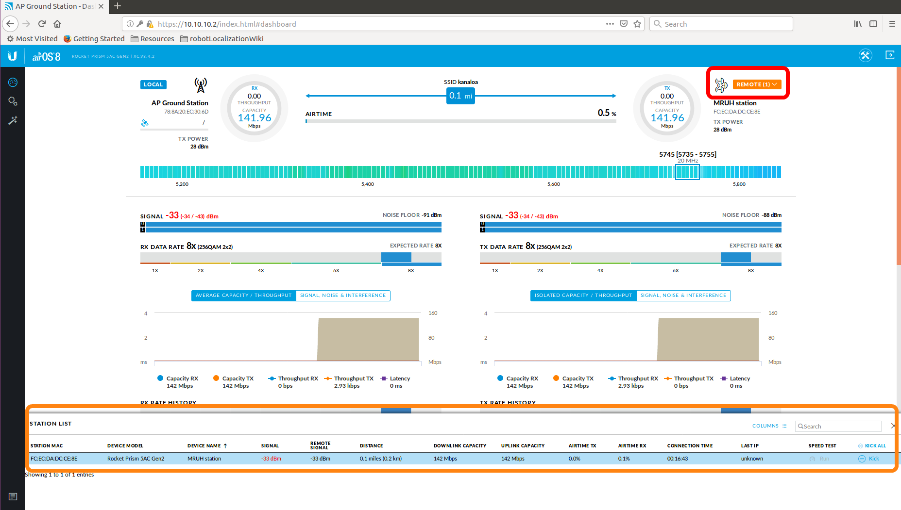
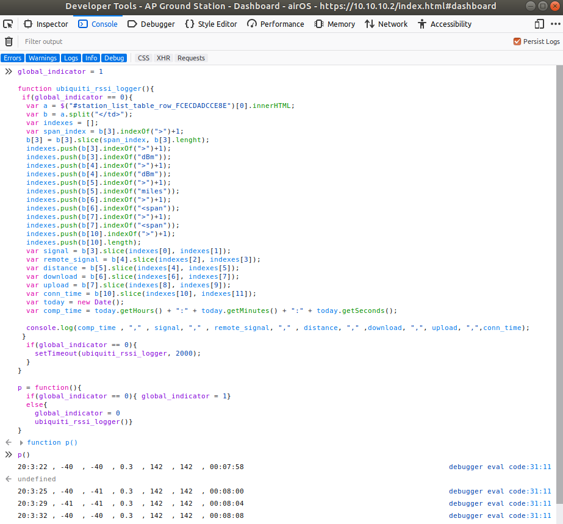
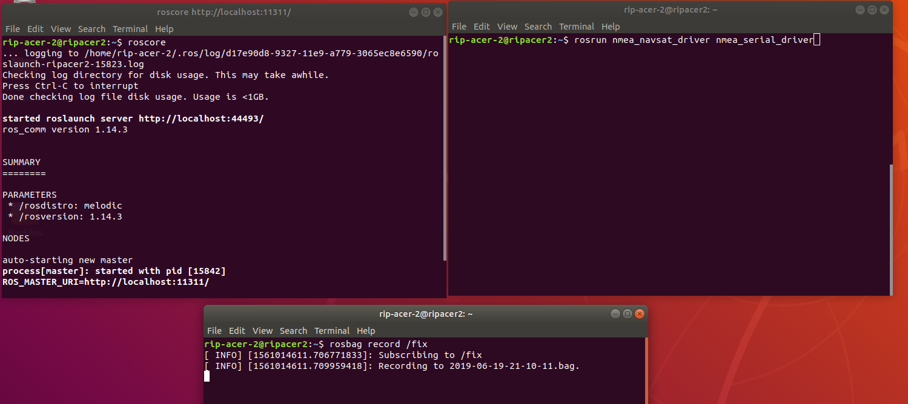

# Ubiquiti RSSI and GPS Logger
This script takes data from the Ubiquiti prism and bullet dashboard and relays key data back with a timestamp. The main purpose of these scripts is to log connection info so that it can in turn be paired with GPS sensor data to see the correlation between distance between communications relays and their signal strength. The GPS data is collected utilizing ROS.

## Prerequisites
- A Internet Browser
- 2 Ubiquiti prisms (or 2 Ubiquiti bullets)
- Linux based Operating System (that is ROS compatible)
- ROS Kinetic (or higher)
- nmea_navsat_driver (ROS package)

## Hardware Setup

- Power Ubiquiti Prism (or Ubiquiti Bullet) using a Power Over Ethernet (POE) adapter
- Connect LAN connection of POE to computer via Ethernet
- Ensure the computer is connected to that Ethernet connection in the Network Manager
- Power on second Ubiquiti Prism (or Ubiquiti Bullet) using a (POE) adapter
- Connect LAN connection of POE to second computer via Ethernet
- Ensure the two prisms connect to each other by checking the indicator lights


- Start the ROS master on host computer
- Run ROS Launch files to publish GPS data

## Running the Ubiquiti RSSI Logger

1) Open a web browser on the computer and type in IP of Ubiquiti Prism (or Ubiquiti Bullet)

2) Log in to the Ubiquiti dashboard

3) In the top right corner, click the orange drop down button, and ensure status table is displaying at bottom of web page.



4) Open the inspector console of the browser (Ctrl + Shift + I)

5) Click on the console tab

6) Paste in the code from ubiquiti_rssi_logger.js (for Ubiquiti Prism) or ubiquiti_rssi_logger_bullet.js (for Ubiquiti Bullet)

7) When you are ready to start the script, simply type `p()` into the console. Data will be outputted below.



8) To pause the RSSI looger, type `p()` again

9) To resume data collection after pausing, type `p()` again

10) When you are done collecting data, export results by right clicking on the console output and selecting either Copy All or Save As (depending on your browser)


## Collecting GPS Data

1) Start the ROS master on both computers by opening the terminal and typing
```bash
roscore
```

2) In a separate terminal, run the roslaunch file for the GPS by typing
```bash
rosrun nmea_ nmea_navsat_driver nmea_serial_driver
```
 on both computers

3) In a serperate terminal, run the rosbag command to collect the GPS data and save it using the command
```bash
rosbag record /fix
```
. '/fix' is the standard ROS topic name for the GPS sensor.



4) When you are finished collecting data, simply hit the 'Ctrl + C' buttons in each terminal to stop running it. The bag file will be saved to the directory the terminal is in with the name being the data which recording started.


## Post Processing RSSI and GPS Data

1) Convert the bag file with the GPS data to CSV with the command:
```bash
rostopic echo -b file.bag -p /fix
```
Replace 'file.bag' with the name of your bag file and '/fix' is the topic we are trying to extract the data for

2)

## Notes

- The RSSI script is set to extract the connection info every 2 seconds (or 2000 milliseconds), this can be changed in the script by editing the script at `setTimeout(ubiquiti_rssi_logger, 2000);`, where 2000 can be changed to your desired time in milliseconds. The returned output may not be exactly 2 seconds apart, due to the time it takes to process the information before outputing it.


- The data returned is as follows: `[Timestamp, Ground_Station Signal, Second Router Signal, Estimated Distance, Download Speed, Upload Speed, Connection Time]`

- When you copy or save the output from the console, note it will also copy the code you set in the beginning. Make sure to delete these first couple lines to ensure your file only contains Ubiquiti data. Your Inspector tools may also output the line number in the RSSI script which is printing the data. This should be deleted as well before post processing.

- The RSSI output is formatted to work as a CSV file. When saving the output, just use the file extension `.csv`, and it will be able to be imported into most spreadsheet software.
